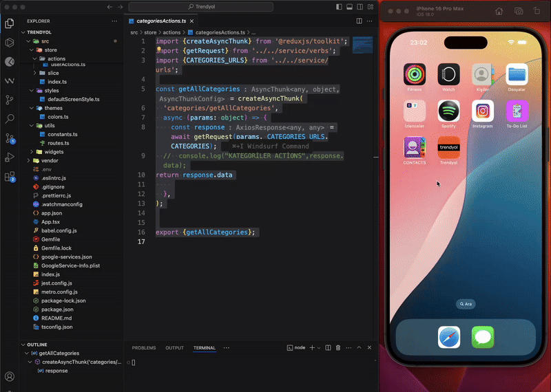

# Trendyol Clone - React Native & TypeScript

This project is a simple and clean Trendyol clone developed using React Native and TypeScript. It supports basic e-commerce functionalities.

## Features
Add/remove products to favorites
Add, remove, and delete items from the cart
User login & logout

## Libraries Used
TypeScript → Strongly typed JavaScript for better development experience
React Navigation → For page transitions and navigation
Redux Toolkit → Global state management
Async Storage → Storing user data and cart information
React Native Vector Icons → For icons
React Native Async Storage → Local data storage
Firebase Authentication → User authentication (login/logout)

## 🌟 Project Goal:

This project aims to provide users with an easy, fast, and enjoyable shopping experience on mobile devices. With its dynamic design, user-friendly navigation, and performance-oriented architecture, it serves as an inspiring example for modern e-commerce applications.

#ReactNative #TrendyolClone #MobileAppDevelopment #EcommerceApp  #Redux-Toolkit

### Feel free to contact me to learn more and explore my projects!

###  Designed by <a href="https://www.linkedin.com/in/h%C3%BCseyin-aslan-128519203/" target="_blank">Hüseyin ASLAN</a> 

### GIF

